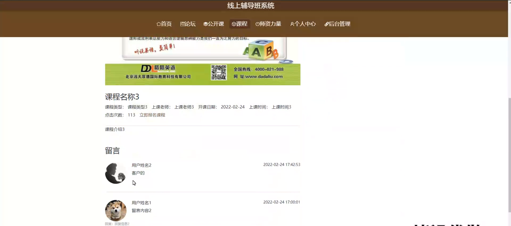

# 基于springboot的线上辅导班系统

---
### 👉作者QQ ：1556708905 微信：zheng0123Long (支持定制修改、部署调试、定制毕设)

### 👉接网站建设、小程序、H5、APP、各种系统等

---

#### 介绍

随着互联网技术的飞速发展，线上教育成为了教育领域的重要组成部分。为了满足广大学习者对优质教育资源的需求，我们开发了基于 Spring Boot 的线上辅导班系统，旨在为用户提供便捷、高效、个性化的学习体验。

#### 技术栈

后端技术栈：Springboot+Mysql+Maven

前端技术栈：Vue+Html+Css+Javascript+ElementUI

开发工具：Idea+Vscode+Navicate

#### 系统功能介绍

（一）管理员角色  
个人中心：管理员可以在此查看和修改个人信息，接收系统通知和重要消息。  
基础数据管理：维护系统所需的基础数据，如学科分类、课程级别、教学大纲等，确保系统数据的准确性和完整性。  
论坛管理：对论坛进行全面管理，包括创建和删除论坛板块、审核论坛帖子、处理违规内容，保证论坛的交流环境健康有序。  
公开课管理：负责公开课的安排和管理，包括确定公开课的主题、时间、授课教师、参与人数等，并对公开课的效果进行评估。  
课程管理  
课程管理：对各类课程进行创建、编辑和删除，设置课程的详细信息，如课程名称、简介、目标受众、授课方式等。  
课程留言管理：查看和回复学生在课程页面留下的留言，及时解决学生的疑问和反馈。  
课程收藏管理：了解学生对课程的收藏情况，以便分析热门课程和学生的兴趣点。  
课程报名管理：处理学生的课程报名申请，审核报名信息，安排学生的课程学习。  
师资力量管理：对教师的信息进行管理，包括教师的个人资料、教学资质、授课经验等，同时可以对教师进行评价和考核。  
用户管理：管理系统中的用户信息，包括学生和教师的注册审核、信息修改、账号冻结或解冻等操作。  
轮播图信息：设置系统首页的轮播图，展示重要的课程推荐、活动通知等信息，吸引用户的注意力。  

（二）用户角色  
论坛：用户可以在论坛中与其他学生和教师进行交流，分享学习心得、提问、讨论课程相关问题等。  
公开课：查看公开课的安排，选择感兴趣的公开课进行观看和学习。  
课程：浏览系统提供的各类课程，查看课程详情，并进行课程的收藏、报名和学习。  
师资力量：了解教师的背景和教学特长，选择适合自己的教师和课程。  
个人中心：用户可以在个人中心修改个人资料、查看学习记录、收藏的课程、报名的课程、课程留言回复等。  
后台管理  
论坛管理：用户可以在论坛中发布帖子、回复他人帖子、删除自己发布的帖子等。  
公开课管理：用户可以对已参加的公开课进行评价和反馈。  
课程管理  
课程管理：用户可以查看自己报名和学习的课程进度。  
课程留言管理：用户可以查看自己在课程页面的留言和教师的回复。  
课程收藏管理：用户可以管理自己收藏的课程，方便随时查看。  
课程报名管理：用户可以取消已报名的课程或重新报名其他课程。  
师资力量管理：用户可以对教师进行评价和推荐。  
轮播图信息：用户可以通过轮播图了解系统的最新活动和重要课程推荐。  

#### 系统作用

线上辅导班系统的主要作用包括：

提升教育管理效率： 为管理员提供全面的管理工具，帮助高效管理课程、公开课、教师和用户等信息，确保系统的正常运行。  
优化用户学习体验： 用户可以方便地浏览和参与课程和公开课，通过论坛与其他用户和教师互动，提高学习的积极性和效果。  
促进信息交流： 通过论坛和留言功能，用户和教师可以进行实时的交流和反馈，增强学习的互动性和参与感。  
提供便捷的管理功能： 用户可以通过个人中心和后台管理模块，方便地管理自己的学习和参与记录，提高系统的易用性和用户体验。  

#### 系统功能截图

代码结构

数据库表

登录

前台页面首页

论坛

公开课

课程

师资力量

个人中心

用户端后台管理

公开课管理

课程报名管理

师资力量管理

课程管理

用户管理

#### 总结

基于 Spring Boot 的线上辅导班系统通过明确的角色分工和丰富的功能模块，为学生和管理员打造了一个高效、便捷、互动性强的线上教育平台。它不仅为学生提供了优质的学习资源和个性化的学习体验，也为管理员提供了有效的管理手段，有助于推动线上教育的发展，提升教育的质量和覆盖面。

#### 使用说明

创建数据库，执行数据库脚本 修改jdbc数据库连接参数 下载安装maven依赖jar 启动idea中的springboot项目

前台登录页面
http://localhost:8080/xianshangfudaoban/front/index.html

后台登录页面
http://localhost:8080/xianshangfudaoban/admin/dist/index.html

管理员			账户:admin 	密码：admin
用户				账户:a1 		密码：123456
用户				账户:a2 		密码：123456
用户				账户:a3 		密码：123456
